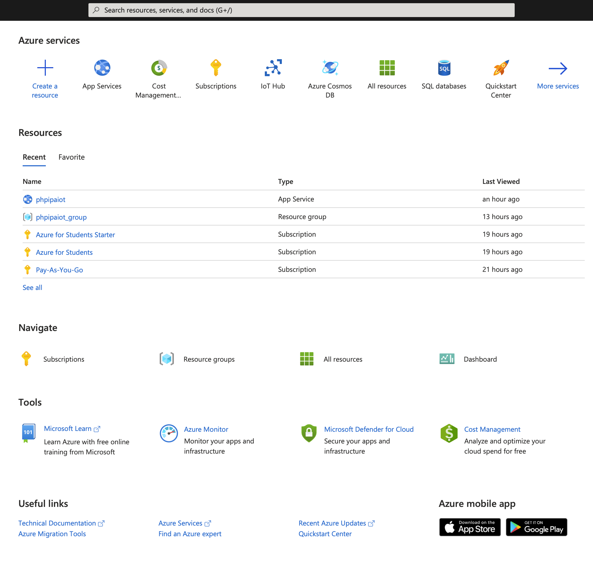

# Cvičenie 1

<ol>
    <li>Potreba zabezpečiť si **ESP32** alebo **ESP8266**. Odporúčam ESP32, pretože je trochu výkonnejšie, ale na prácu Vám postačí aj ESP8266</li>
    <li>Vytvorenie NetAcad konta a uplatenie licenčného kľúča</li>
    <li>Začať pracovať na NetAdac cvičeniach</li>
</ol>

### Poznámka k ESP zadaniu
ESP32 - [eshop](https://techfun.sk/produkt/vyvojova-doska-node-mcu-esp32-wifi-bluetooth/?gclid=CjwKCAjwpqCZBhAbEiwAa7pXeUJ_Ipu76exULoNBHaVDOrYrkShmd0S9I_hKJs2rbghaBR1MM_Nd2RoCqS8QAvD_BwE&attribute_pa_naspajkovane-piny=ano)\
Naspájkované piny \
Dokúpiť senzory a akčné členy

### Prihlásenie sa do NetAcad
[LINK](https://www.netacad.com)

Reedem token vam nadiktujem

### Prihlásenie sa do Microsoft Azure

Je potrebné vytvoriť si konto na [Microsoft Azure](https://portal.azure.com/). **Používatje študentské maily!**. Od Microsoftu dostanete študentské kredity v hodnote 100$, ktoré budete môcť využívať pri Vaších zadaniach. Možnosť využiť aj Microsoft Azure Starter pack for Students.

Tieto kontá na Microsoft Azure budeme používať neskôr na cvičeniach. Odporúčam Vám sa s týmto prostredím zoznámiť.
